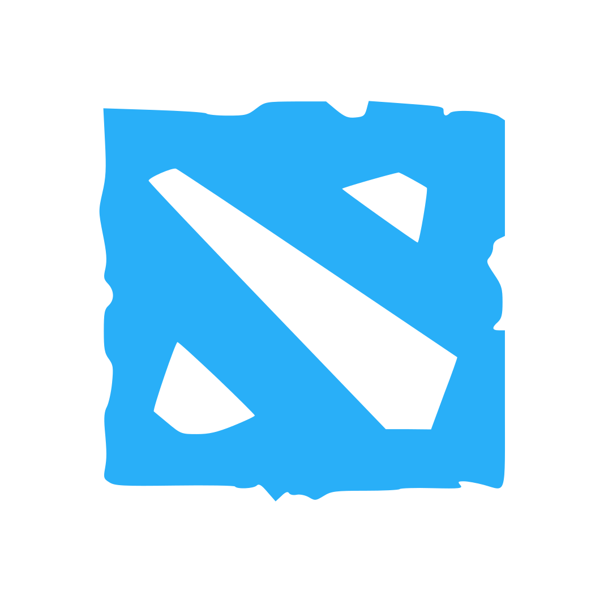
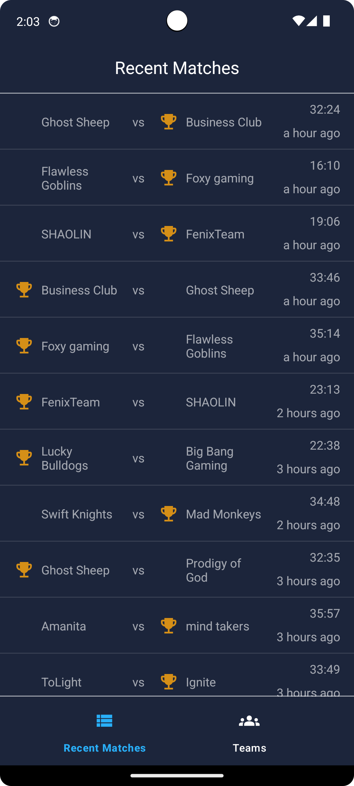
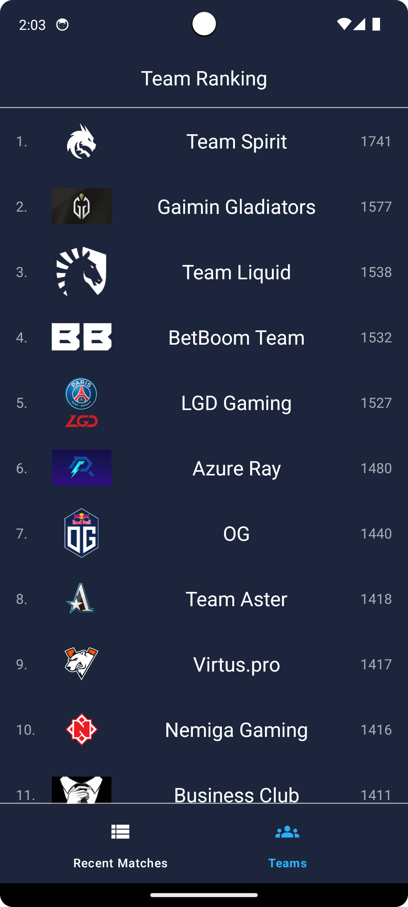
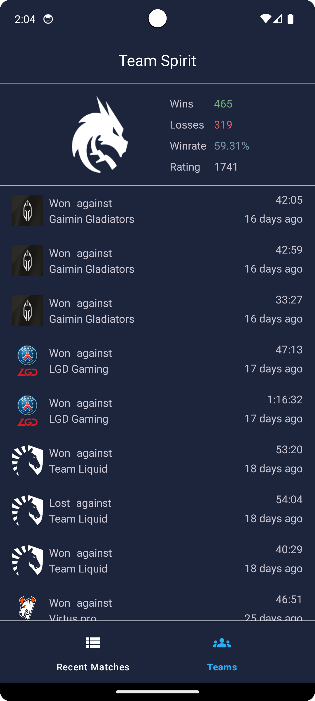
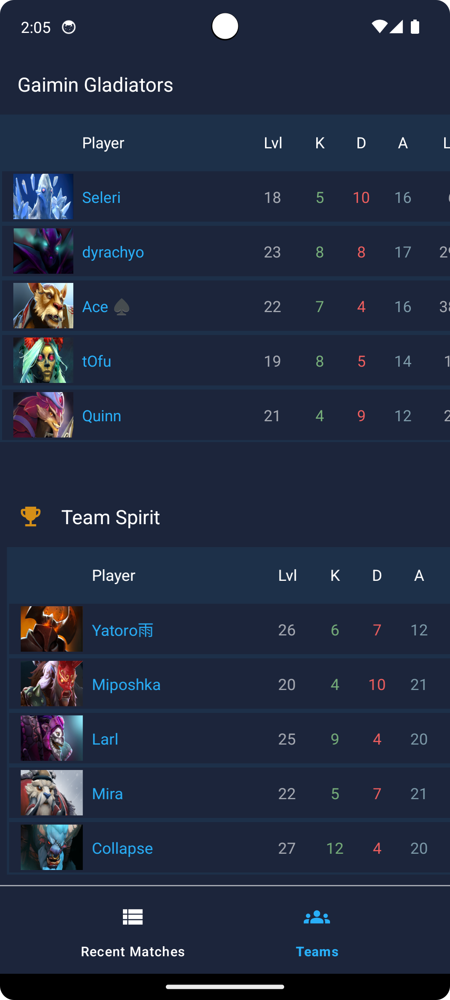
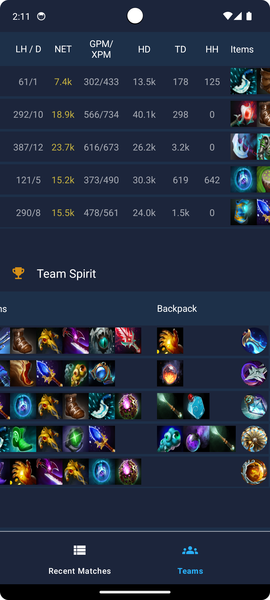
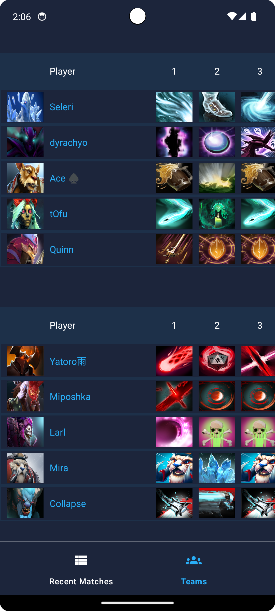
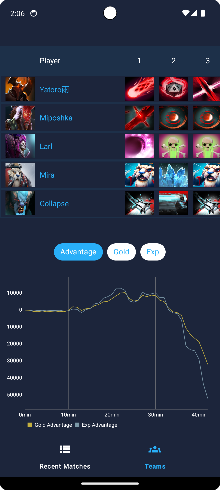
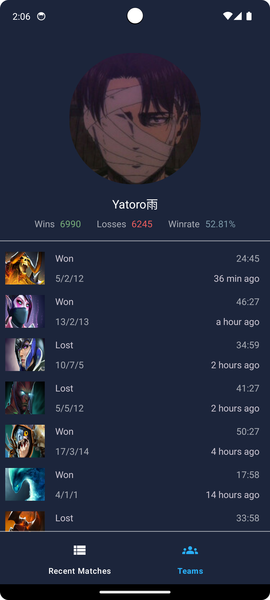

  
  
  

# Dota Stats

  

>[!NOTE] 
>This app requieres a valid network connection to pull data from the API. Minimal [SDK version](https://apilevels.com) required to run the app: **24**

  
<!-- TABLE OF CONTENTS -->

  
Table of Contents

  <ol>
    <li>
      <a href="#overview">Overview</a></li>
    <li><a href="#features">Features</a></li>
    <li><a href="#tech-usage">Tech Usage</a></li>
    <li><a href="#built-with">Built with</a></li>
    <li><a href="#author">Author</a></li>
  </ol>

## Overview

  

Dota Stats is a kotlin based android app which provides information of played matches for Dota 2. This app relies on the [OpenDota](https://www.opendota.com/) API
to get the latest match results.

## Features
- **Recent Matches**
- **Team Ranking**
- **Team Profile**
- **Match Details**
- **Player Profile**

## Screenshots

  
  
  
  
  
  
  
  
  

## Tech Usage
- **[MVVM Pattern](https://www.geeksforgeeks.org/mvvm-model-view-viewmodel-architecture-pattern-in-android/)**
- **[Fragments](https://developer.android.com/guide/fragments)**
- **[ViewModel](https://developer.android.com/topic/libraries/architecture/viewmodel)**
- **[LiveData](https://developer.android.com/topic/libraries/architecture/livedata)**
- **[Navigation components](https://developer.android.com/guide/navigation/get-started)**
- **[RecyclerView](https://developer.android.com/reference/androidx/recyclerview/widget/RecyclerView)** 

## Built with
- **[Room Database](https://developer.android.com/training/data-storage/room)** for caching
- **[Retrofit2](https://github.com/square/retrofit)** for network requests
- **[Moshi](https://github.com/square/moshi)** for JSON serialization/deserialization
- **[Coil](https://github.com/coil-kt/coil)** for image handling
- **[MPAndroidChart](https://github.com/PhilJay/MPAndroidChart)** displaying charts
- **[android-gif-drawable](https://github.com/koral--/android-gif-drawable)** displaying gifs
- **[Ksp](https://github.com/google/ksp)** annotation processing 
- **[Material 3](https://m3.material.io)** components for UI

## Author
[NoctRise](https://github.com/noctRise/)

